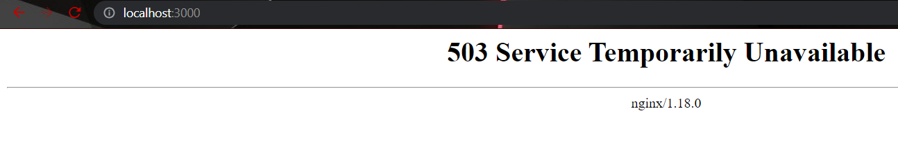

# Tugas Akhir Dicoding "BELAJAR JARINGAN KOMPUTER UNTUK PEMULA"

## node version: 18.3.0

- Mengubah port NGINX dari 80 ke 3000 (bukan port web server Node.js).
- Mengubah konfigurasi rate limit menjadi 6 request per menit alias 1 request setiap 10 detik.
- Mengubah respons web server Node.js yang semula “Hello world!” menjadi nama lengkap peserta.
- Mengimplementasikan konfigurasi yang sama pada Apache2.

---

Cara instal project:

1. Melakukan cloning dari repositori GitHub yang sudah disediakan oleh Dicoding

```
git clone https://github.com/dicodingacademy/a387-jarkom-labs.git
```


2. Install node modules

```
npm i
```


2. Jalankan project

```
npm run start
```


---

Step pengerjaan

1. update wsl

```
sudo apt update
```


2. install nginx pada wsl

```
sudo apt-get install nginx -y
```


5. check apakah nginx sudah berjalan pada wsl

```
sudo service nginx status
```

jika belum (failed), maka jalankan service nginx terlebih dahulu

```
sudo /etc/init.d/nginx start
```


6. lakukan konfigurasi nginx sesuai kriteria yang diinginkan pada GUI Nano, jika sudah => press (CTRL + X) => press (CTRL + Y) => press (ENTER) => KELUAR GUI NANO

```
sudo nano /etc/nginx/sites-available/default
```


check apakah terdapat error pada konfigurasi nginx

```
sudo nginx -t
```

re-run service nginx untuk memperbarui konfigurasi yang sudah dilakukan

```
sudo service nginx restart
```


7. Tampilan akhir website pada port:3000
   
   Tampilan website ketika rate limit berjalan (6 request per menit / 1 request setiap 10 detik)
   
